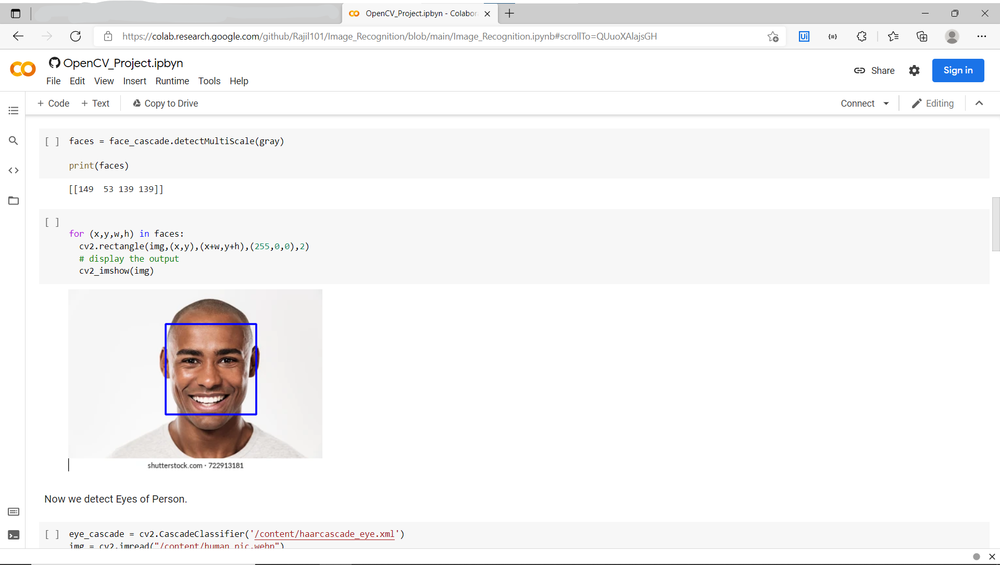

# Image_Recognition

In these project, I perform face & eye detection of person with any race,ethnicity,color using opencv.
You can also detect your realtime image in these model.

Made using-

•CascadeClassifier() function for harcascading the file for face detection and applyed same procedure for eye detection using harcascade_eye file,

•used imread() function for file reading,

•cv2_imshow used in google colab and cv2.imshow for normal python file,

•converted color image into grayscale for further feature detection, 

•also obtained detection process on multiple face detection in single file(image).

**Detections**

•color image

•grascale image

•face detection

•eye detection

*You need to open (.ipynp) file in google colab ,and download other four essential files to make changes and detect the person's faces and eyes.

